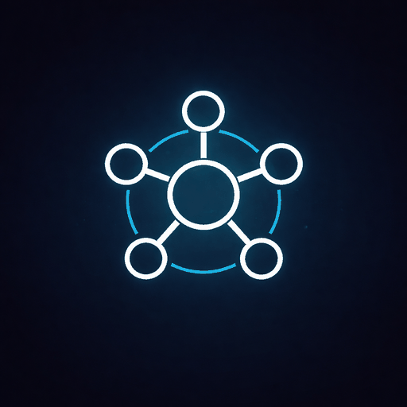

# 🔥 AgentForge

**Enterprise AI Agent Builder Platform**

[](https://python.org)
[](https://fastapi.tiangolo.com)
[](https://docker.com)

AgentForge is an enterprise platform for building, deploying, and managing AI agents. Create powerful agents with custom tools, knowledge bases, and guardrails - all through a simple web interface.

**🌐 Live Demo:** [https://agentforge.up.railway.app](https://agentforge.up.railway.app)



---

## ✨ Features

### Core Features
- **🤖 AI-Assisted Agent Creation** - Describe your goal, AI generates the full configuration
- **💬 Agent Chat** - Real-time chat with tool calling and memory
- **🛡️ Guardrails** - Anti-hallucination, PII protection, topic control
- **📝 Agent Memory** - Cross-session memory persistence

### LLM Support
- **OpenAI** - GPT-4o, GPT-4, GPT-3.5 ✅
- **Anthropic** - Claude 3.5, Claude 3 ✅
- **Ollama** - Local models (Llama, Mistral, etc.) ✅
- **Azure OpenAI** - Via configuration ✅

### Tools
- **📚 Knowledge Base (RAG)** - Upload documents, scrape websites
- **🔌 API Tool** - Connect to any REST API
- **🗄️ Database Tool** - Query SQL databases
- **📧 Email Tool** - Send emails via Gmail/SendGrid

### Security
- **🔐 Authentication** - Email/password + Google OAuth
- **👥 RBAC** - Role-based access control (5 default roles)
- **🔑 MFA** - Two-factor authentication (TOTP)
- **📋 Audit Logs** - Complete activity logging

### Demo Lab
- **🧪 Mock API Generation** - AI generates realistic API responses
- **📄 Mock Documents** - Generate test PDFs and images
- **🎯 Industry Templates** - Healthcare, Finance, HR, and more

---

## 🚀 Quick Start

### Using Docker (Recommended)

```bash
# Clone the repository
git clone https://github.com/ahamdihussein-star/agentforge.git
cd agentforge

# Copy environment file
cp .env.example .env
# Edit .env with your API keys (at minimum: OPENAI_API_KEY)

# Start with Docker Compose
docker-compose up -d

# Open http://localhost:8000
```

### Manual Installation

```bash
# Clone the repository
git clone https://github.com/ahamdihussein-star/agentforge.git
cd agentforge

# Create virtual environment
python -m venv venv
source venv/bin/activate  # On Windows: venv\Scripts\activate

# Install dependencies
pip install -r requirements.txt

# Install Playwright for web scraping
playwright install chromium

# Set environment variables
export OPENAI_API_KEY=your-key-here

# Run the server
uvicorn api.main:app --host 0.0.0.0 --port 8000

# Open http://localhost:8000
```

---

## 🔧 Environment Variables

Create a `.env` file with:

```env
# Required
OPENAI_API_KEY=sk-...

# Optional - Additional LLM Providers
ANTHROPIC_API_KEY=sk-ant-...

# Optional - OAuth (for Google login)
GOOGLE_CLIENT_ID=...
GOOGLE_CLIENT_SECRET=...

# Optional - Email (for verification emails)
SENDGRID_API_KEY=SG....
EMAIL_FROM=noreply@yourdomain.com
BASE_URL=http://localhost:8000
```

---

## 📖 Documentation

Full documentation is available at: [docs/MASTER_DOCUMENTATION.md](docs/MASTER_DOCUMENTATION.md)

### Quick Links
- [Architecture Overview](docs/MASTER_DOCUMENTATION.md#-system-architecture)
- [Features List](docs/MASTER_DOCUMENTATION.md#-features---complete-list)
- [LLM Providers](docs/MASTER_DOCUMENTATION.md#-llm-providers)
- [Security Module](docs/MASTER_DOCUMENTATION.md#-security-module)
- [Deployment Guide](docs/MASTER_DOCUMENTATION.md#-deployment-architecture)
- [API Reference](docs/MASTER_DOCUMENTATION.md#-api-reference)

---

## 🏗️ Architecture

```
┌─────────────────────────────────────────────────────────┐
│                    AgentForge Platform                   │
├─────────────────────────────────────────────────────────┤
│  Frontend (ui/index.html)                                │
│  └── Single Page Application (Tailwind CSS)              │
├─────────────────────────────────────────────────────────┤
│  API Layer (FastAPI)                                     │
│  ├── api/main.py (Agents, Tools, RAG, Settings)          │
│  └── api/security.py (Auth, Users, Roles)                │
├─────────────────────────────────────────────────────────┤
│  Core Modules                                            │
│  ├── core/agent/ (Engine, Generator)                     │
│  ├── core/llm/ (Providers, Router, Registry)             │
│  ├── core/tools/ (API, Database, RAG)                    │
│  └── core/security/ (Services, State)                    │
├─────────────────────────────────────────────────────────┤
│  Data Layer                                              │
│  ├── JSON Storage (data/*.json)                          │
│  └── ChromaDB (Vector Store)                             │
└─────────────────────────────────────────────────────────┘
```

---

## 🔌 Integration Status

### LLM Providers
| Provider | Status | Notes |
|----------|--------|-------|
| OpenAI | ✅ Ready | Full support with tool calling |
| Anthropic | ✅ Ready | Full support with tool calling |
| Ollama | ✅ Ready | Local model support |
| Azure OpenAI | ✅ Ready | Via OpenAI provider |
| Google Gemini | 🔜 Planned | UI ready |
| AWS Bedrock | 🔜 Planned | UI ready |

### Vector Databases
| Database | Status | Notes |
|----------|--------|-------|
| ChromaDB | ✅ Ready | Default, fully tested |
| Pinecone | 🔜 Planned | Config ready |
| Qdrant | 🔜 Planned | Config ready |

### Authentication
| Method | Status |
|--------|--------|
| Email/Password | ✅ Ready |
| Google OAuth | ✅ Ready |
| Microsoft OAuth | 🔜 Planned |
| SAML SSO | 🔜 Planned |

---

## 📁 Project Structure

```
agentforge/
├── api/
│   ├── main.py          # Main API endpoints
│   └── security.py      # Security endpoints
├── core/
│   ├── agent/           # Agent engine
│   ├── llm/             # LLM providers
│   ├── tools/           # Built-in tools
│   └── security/        # Security services
├── ui/
│   └── index.html       # Frontend SPA
├── data/
│   ├── security/        # Users, roles, etc.
│   └── *.json           # App data
├── docs/
│   └── MASTER_DOCUMENTATION.md
├── Dockerfile
├── docker-compose.yml
├── requirements.txt
└── README.md
```

---

## 🛣️ Roadmap

### In Progress
- [ ] Database migration (JSON → PostgreSQL)
- [ ] Additional LLM providers (Gemini, Bedrock)
- [ ] Streaming responses

### Planned
- [ ] Frontend modernization (React)
- [ ] Multi-tenancy support
- [ ] Kubernetes deployment
- [ ] Agent marketplace

See full roadmap in [MASTER_DOCUMENTATION.md](docs/MASTER_DOCUMENTATION.md#-recommendations--roadmap)

---

## 🤝 Contributing

Contributions are welcome! Please:

1. Fork the repository
2. Create a feature branch (`git checkout -b feature/amazing-feature`)
3. Commit your changes (`git commit -m 'Add amazing feature'`)
4. Push to the branch (`git push origin feature/amazing-feature`)
5. Open a Pull Request

---

## 📄 License

This project is licensed under the Apache 2.0 License.

---

## 🙏 Support

- **Issues:** [GitHub Issues](https://github.com/ahamdihussein-star/agentforge/issues)
- **Documentation:** [MASTER_DOCUMENTATION.md](docs/MASTER_DOCUMENTATION.md)

---

Built with ❤️ for the AI community
